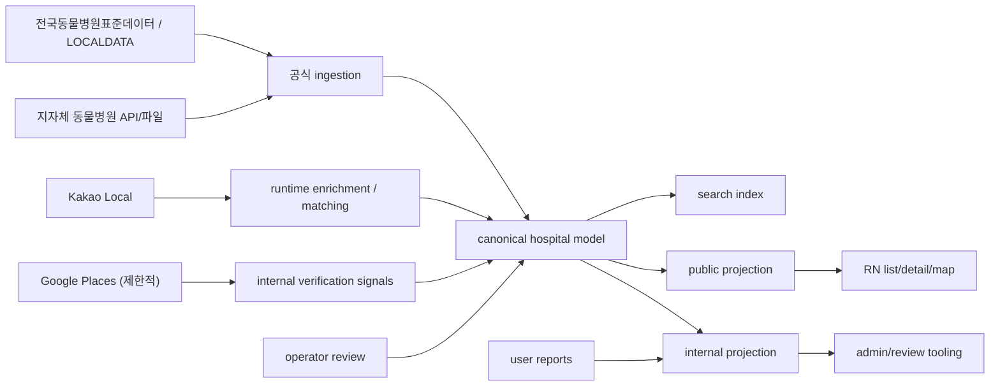

# 우리동네 동물병원 아키텍처 설계서

업데이트: 2026-04-17

## 1. 배경

### 1-1. 왜 이 도메인이 필요한가

NURI의 다음 확장 우선순위는 `우리동네 동물병원`이다. 현재 프로젝트 메모리와 task 문서 기준으로 이 도메인은 v1.1의 실질 1순위이며, 기존 위치/지도/리스트/상세 구조를 가장 많이 재사용할 수 있는 신규 도메인이다.

사용자가 이 도메인에서 실제로 해결하려는 문제는 명확하다.

- 지금 내 위치 근처에서 진료 가능한 병원을 빠르게 찾고 싶다.
- 적어도 `문 닫은 병원`, `전화 안 되는 번호`, `잘못된 주소`, `검증 없는 24시간/야간/특수동물` 정보는 피하고 싶다.
- 길찾기, 전화, 운영상태 확인까지 한 흐름으로 끝내고 싶다.

NURI에서 이 도메인이 필요한 이유도 분명하다.

- 기록/건강관리/일정과 직접 연결되는 생활형 핵심 도메인이다.
- 기존 `펫동반 장소 탐색`보다 보호자의 즉시 행동 전환 가치가 높다.
- 단순 탐색 기능이 아니라, 건강관리와 일정 쓰기 경험의 현실적 entry point가 될 수 있다.

### 1-2. “카카오/네이버급”을 NURI에서는 어떻게 정의할 것인가

이번 설계에서 `카카오/네이버급`은 기능 수가 아니다. 아래 경험 품질을 뜻한다.

- 현재 위치 기준으로 빠르게 결과가 보인다.
- 리스트, 지도, 상세가 끊기지 않고 이어진다.
- 거리, 전화, 길찾기 CTA가 직관적이다.
- stale 위치를 현재 위치처럼 속이지 않는다.
- 정보가 불확실하면 불확실하다고 명확히 보인다.
- 왜 이 병원이 보이는지, 왜 이 필드가 신뢰 가능한지 설명 가능하다.

즉 `많이 보여주는 앱`이 아니라 `보여준 정보의 근거를 설명할 수 있는 앱`이어야 한다.

### 1-3. 병원 도메인이 일반 장소 탐색보다 왜 더 엄격해야 하는가

병원 정보는 잘못된 확신이 바로 위해로 이어질 수 있다.

- 잘못된 운영시간은 헛걸음과 응급 대응 실패를 만든다.
- 잘못된 전화번호는 즉시 행동을 막는다.
- 검증되지 않은 `24시간`, `야간`, `응급`, `특수동물 진료` 문구는 병원 선택을 왜곡한다.
- 리뷰/평점 중심 탐색은 병원 도메인에서는 신뢰 지표로 부적절하다.

따라서 병원 도메인은 기존 `후보 / 확인 필요 / 검수 반영` 원칙을 유지하되, 필드 단위까지 더 보수적으로 세분화해야 한다.

### 1-4. 현재 NURI 코드 기준 재사용 가능한 구조

현재 코드에서 재사용 가능한 구조는 아래다.

- 위치 freshness / 권한 / refresh
  - `src/hooks/useCurrentLocation.ts`
- 위치 기반 검색 orchestrator
  - `src/hooks/useLocationDiscovery.ts`
- 후보 normalize/service 계층
  - `src/services/locationDiscovery/service.ts`
- 지도 클러스터링 / viewport 복원
  - `src/components/maps/LocationDiscoveryMapPanel.tsx`
- 리스트/상세/지도 미리보기
  - `src/screens/LocationDiscovery/*`

현재 구조의 핵심 장점은 이미 `raw provider -> normalized item -> screen` 경계가 있다는 점이다. 병원 도메인은 이 경계를 유지한 채, `공식 인허가 master -> canonical -> public projection`을 추가하면 된다.

### 1-5. 검토한 공식 외부 소스

- 공공데이터포털 `전국동물병원표준데이터`
  - [https://www.data.go.kr/data/15155679/standard.do](https://www.data.go.kr/data/15155679/standard.do)
- LOCALDATA 데이터활용가이드
  - [https://www.localdata.go.kr/portal/portalDataGuide.do?menuNo=30002](https://www.localdata.go.kr/portal/portalDataGuide.do?menuNo=30002)
- 공공데이터포털 `경기도_동물병원 현황`
  - [https://www.data.go.kr/data/15057867/openapi.do](https://www.data.go.kr/data/15057867/openapi.do)
- Kakao Local 개요 / REST / 쿼터
  - [https://developers.kakao.com/docs/latest/ko/local/common](https://developers.kakao.com/docs/latest/ko/local/common)
  - [https://developers.kakao.com/docs/latest/en/local/dev-guide](https://developers.kakao.com/docs/latest/en/local/dev-guide)
  - [https://developers.kakao.com/docs/latest/ko/getting-started/quota](https://developers.kakao.com/docs/latest/ko/getting-started/quota)
- NAVER Maps Geocoding / Reverse Geocoding / Directions 5
  - [https://api.ncloud-docs.com/docs/en/ai-naver-mapsgeocoding-geocode](https://api.ncloud-docs.com/docs/en/ai-naver-mapsgeocoding-geocode)
  - [https://api.ncloud-docs.com/docs/en/application-maps-reversegeocoding](https://api.ncloud-docs.com/docs/en/application-maps-reversegeocoding)
  - [https://api.ncloud-docs.com/docs/en/ai-naver-mapsdirections-driving](https://api.ncloud-docs.com/docs/en/ai-naver-mapsdirections-driving)
- Google Places Text Search / Place Details / Data Fields / Policies / Place IDs
  - [https://developers.google.com/maps/documentation/places/web-service/text-search](https://developers.google.com/maps/documentation/places/web-service/text-search)
  - [https://developers.google.com/maps/documentation/places/web-service/place-details](https://developers.google.com/maps/documentation/places/web-service/place-details)
  - [https://developers.google.com/maps/documentation/places/web-service/data-fields](https://developers.google.com/maps/documentation/places/web-service/data-fields)
  - [https://developers.google.com/maps/documentation/places/web-service/policies](https://developers.google.com/maps/documentation/places/web-service/policies)
  - [https://developers.google.com/maps/documentation/places/web-service/place-id](https://developers.google.com/maps/documentation/places/web-service/place-id)

## 2. 문제

### 2-1. 현재 `pet-friendly-place` 구조를 그대로 쓰면 안 되는 이유

현재 `locationDiscovery/service.ts`는 `walk`와 `pet-friendly-place` 후보를 Kakao Local 중심으로 모으고, 일부 메타를 merge해 `LocationDiscoveryItem`으로 정규화한다. 이 방식은 병원 도메인에 그대로 쓰면 위험하다.

- 현재 `pet-friendly-place`는 외부 후보 + 선택적 메타 구조다.
- `LocationDiscoveryVerificationStatus`는 장소 탐색 기준이며, 병원 필드의 민감도를 반영하지 않는다.
- 현재 `publicTrust`는 엔터티 단위 공개 라벨 중심이고, 병원 필드별 민감도를 설명하기엔 부족하다.
- 현재 `service.ts`의 negative keyword 필터는 병원을 기존 장소 탐색에서 제외하는 방향이다.

결론적으로 병원은 `새 도메인`으로 만들어야 한다. 기존 UI와 위치 stack은 재사용하되, 데이터 소스와 canonical model은 분리해야 한다.

### 2-2. 공식 데이터만으로도 부족하고, 지도 API만으로도 위험하다

공식 인허가 데이터만으로는 빠른 UX가 약해진다.

- 사용자 주변 병원 탐색, 이름 검색, 거리 중심 정렬, 외부 지도 전환은 지도 플레이스 API 경험이 더 좋다.

반대로 지도 API만으로는 신뢰가 약하다.

- Kakao Local은 장소 후보를 잘 주지만, 운영시간/24시간/특수동물 진료를 확정할 구조화된 공식 속성이 아니다.
- Google Places는 opening hours, website, phone, allowsDogs, parkingOptions 등 다양한 필드를 줄 수 있지만, Places 정책상 캐시/저장/표기 제약이 크고, 결과를 public canonical master처럼 쓰기 어렵다.
- NAVER Maps는 geocoding, reverse geocoding, directions는 강하지만, 현재 NURI의 RN 앱 구조와는 직접적인 연결 이점보다 server-side 도입 비용이 더 크다.

### 2-3. 공공데이터 자체도 단일 진실이 아니다

공식 데이터도 주의가 필요하다.

- `전국동물병원표준데이터`는 Localdata 기반 전국 통합 인허가 데이터이며, 인허가일자, 영업상태, 사업장명, 소재지주소 등은 강한 기준이 된다.
- 같은 페이지에서 `갱신주기 수시`, `2일전 기준 현행화`, `좌표계 EPSG:5174`가 명시돼 있다.
- Localdata 가이드는 `전체자료 다운로드 + OPEN API 변동분` 모델을 설명한다.

즉 공식 소스도 `전체 snapshot`과 `delta ingestion`을 함께 설계해야 한다. 또한 `운영상태`와 `실제 오늘 문을 여는지`는 같은 문제가 아니다.

### 2-4. 병원 도메인에서 특히 위험한 필드

아래는 단일 소스로 확정하면 안 된다.

- 운영시간
- 오늘 영업중 여부
- 24시간 여부
- 야간 진료 여부
- 주말 진료 여부
- 특수동물/이색동물 진료 여부
- 응급 대응 가능 여부
- 주차
- 진료과목/장비
- 홈페이지/SNS

이 필드들은 모두 `엔터티 존재`보다 훨씬 높은 검증 강도가 필요하다.

## 3. 선택지

### 3-1. 선택지 A: Kakao Local 중심 실시간 후보 서비스

구성:

- Kakao Local 키워드/카테고리 검색으로 병원 후보 수집
- current location 기반 list/detail 제공
- 병원 메타는 나중에 붙임

장점:

- 개발 속도가 빠르다.
- 현재 `useLocationDiscovery`와 가장 쉽게 맞붙는다.

단점:

- raw 후보 데이터에 과도하게 의존한다.
- 운영시간, 24시간, 특수동물 같은 민감 필드에서 오정보 확률이 높다.
- 병원 도메인에서 가장 중요한 `설명 가능한 신뢰도`를 만들 수 없다.

판정:

- 권장하지 않는다.

### 3-2. 선택지 B: 공공데이터 단독 마스터 + 자체 검색 인덱스

구성:

- Localdata/전국동물병원표준데이터를 전량 ingestion
- 좌표 변환, 검색 인덱스, nearby 검색을 내부 구현
- 외부 지도 API는 길찾기/open app만 사용

장점:

- canonical master와 신뢰도 설계가 명확하다.
- 정책/캐시 리스크가 낮다.

단점:

- 초기 UX 품질이 떨어질 수 있다.
- 이름 검색과 근처 정렬, 주소 보정, 상세 보강 경험이 약해질 수 있다.
- 일부 공식 데이터는 좌표계 변환과 주소 정규화 품질이 별도 작업을 요구한다.

판정:

- 안전하지만 초기 UX가 아쉽다.

### 3-3. 선택지 C: 공식 인허가 마스터 + 지도 API 보강 + public/internal projection 분리

구성:

- `전국동물병원표준데이터(Localdata)`를 병원 존재/기본 상태의 마스터로 사용
- 필요 시 지자체 병원 API를 보조 공식 소스로 사용
- Kakao Local은 runtime candidate matching 및 external place linkage에 사용
- Google Places는 제한적 상세 보강과 internal verification signal에만 사용
- NAVER Maps는 optional geocoding/directions fallback로만 유지
- public projection은 필드별 trust gate를 통과한 값만 노출
- internal projection은 raw source와 충돌 정보를 모두 보존

장점:

- UX와 신뢰도를 동시에 잡을 수 있다.
- 현재 NURI 구조를 가장 적게 깨뜨린다.
- candidate / trust / user layer 원칙을 유지할 수 있다.

단점:

- ingestion, dedupe, verification, projection 분리가 필요하다.
- 구현 난이도는 A보다 높다.

판정:

- 최종 권장안이다.

## 4. 결정 이유

### 4-1. 최종 권장안 1개

`공식 인허가 마스터 + 지도 API 보강 + 필드별 보수적 public projection` 구조를 채택한다.

핵심 원칙은 아래다.

- 병원 엔터티의 존재와 법적 상태는 `공식 소스`가 마스터다.
- 검색과 nearby UX는 `지도 API`가 돕되, 지도 API가 마스터가 되지 않는다.
- 민감 필드는 엔터티 단위가 아니라 `필드 단위 신뢰도`로 관리한다.
- public에는 설명 가능한 값만 노출한다.
- internal에는 raw source, conflict, verification history를 모두 남긴다.

### 4-2. 제품 목표 정의

이 도메인의 제품 목표는 아래다.

- 사용자가 `가까운 병원`을 빠르게 찾게 한다.
- 사용자가 `잘못된 확신` 때문에 위험한 결정을 하지 않게 한다.
- 건강관리/일정/기록 도메인과 연결 가능한 병원 baseline을 만든다.

이번 도메인의 성공 기준은 `리뷰가 많다`가 아니다.

- `전화가 된다`
- `주소가 맞다`
- `폐업 병원이 상단에 안 뜬다`
- `24시간/야간/특수동물 문구가 검증 없는 상태로 노출되지 않는다`
- `왜 확인 필요인지 UI에서 설명된다`

### 4-3. Source of Truth 계층 설계

#### 4-3-1. 계층 정의

| 계층 | 의미 | 공개 가능성 | 예시 |
| --- | --- | --- | --- |
| 공식 마스터 | 법적/행정 기준으로 강하게 확인 가능한 값 | 높음 | 인허가 상태, 사업장명, 주소, 인허가일자 |
| 공식 보강 | 지자체/공공 추가 API에서 교차 확인한 값 | 중간~높음 | WGS84 좌표, 전화번호 |
| 지도 보강 | Kakao/Google/NAVER 등 플레이스/지도 제공값 | 기본은 내부 | 좌표 보정 후보, place URL, website 후보 |
| 검수 확정 | 운영자 또는 병원 직접 확인 후 최근 검수한 값 | 필드별 높음 | 운영시간, 주말 진료, 특수동물 진료 |
| 사용자 제보 | 사용자가 신고/정정 요청으로 남긴 값 | 직접 확정 금지 | 운영시간 틀림, 전화 안 됨 |

#### 4-3-2. 필드별 신뢰도 계층 표

| 필드 | 공식 인허가 기준 확정 가능 | 지도/플레이스 제공값이지만 확정 금지 | 병원 직접 확인/최근 검수 필요 | 사용자 제보만으로 확정 금지 |
| --- | --- | --- | --- | --- |
| 병원 존재 여부 | 가능 | 가능하지만 마스터 아님 | 불필요 | 확정 금지 |
| 사업장명 | 가능 | 가능하지만 alias 취급 | 변경 감지 시 검수 필요 | 확정 금지 |
| 인허가 상태 | 가능 | 불가 | 상태 충돌 시 검수 필요 | 확정 금지 |
| 인허가일자 | 가능 | 불가 | 불필요 | 확정 금지 |
| 소재지 주소 | 가능 | 가능하지만 보조 | 주소 충돌 시 검수 필요 | 확정 금지 |
| 전화번호 | 일부 공식/지자체에서 가능 | 가능 | 공식 부재 시 검수 필요 | 확정 금지 |
| 좌표 | 표준데이터 좌표 또는 지자체 WGS84 가능 | 가능 | 좌표 충돌/오차 크면 검수 필요 | 확정 금지 |
| 운영시간 | 불가 | 가능 | 필요 | 절대 금지 |
| 오늘 영업중 | 불가 | 가능 | 필요 | 절대 금지 |
| 24시간 여부 | 불가 | 가능 | 필요 | 절대 금지 |
| 야간 진료 여부 | 불가 | 가능 | 필요 | 절대 금지 |
| 주말 진료 여부 | 불가 | 가능 | 필요 | 절대 금지 |
| 특수동물/이색동물 진료 | 불가 | 가능 | 필요 | 절대 금지 |
| 응급 대응 가능 여부 | 불가 | 가능 | 필요 | 절대 금지 |
| 주차 | 불가 | 가능 | 필요 | 절대 금지 |
| 휴무일 | 불가 | 가능 | 필요 | 절대 금지 |
| 진료과목/장비 | 불가 | 가능 | 필요 | 절대 금지 |
| 홈페이지/SNS | 불가 | 가능 | 권장 | 절대 금지 |

#### 4-3-3. 민감 필드 상세 정책

| 민감 필드 | 기본 public 정책 | 확정 노출 조건 | 기본 fallback 문구 |
| --- | --- | --- | --- |
| 운영시간 | 기본 숨김 또는 `확인 필요` | 최근 14일 이내 검수 또는 병원 직접 확인 | `운영시간은 확인 후 방문해 주세요.` |
| 24시간 여부 | 기본 숨김 | 최근 7일 이내 검수 + 근거 기록 | `24시간 여부는 전화 확인이 필요해요.` |
| 야간 진료 여부 | 기본 숨김 | 최근 7일 이내 검수 + 근거 기록 | `야간 진료 여부는 확인이 필요해요.` |
| 주말 진료 여부 | `확인 필요` 가능 | 최근 14일 이내 검수 | `주말 진료 여부는 방문 전 확인해 주세요.` |
| 특수동물/이색동물 진료 | 기본 숨김 | 최근 30일 이내 검수 + 진료 대상 근거 | `특수동물 진료는 직접 확인이 필요해요.` |
| 응급 대응 가능 여부 | 기본 숨김 | 최근 7일 이내 검수 + 운영 기준 확인 | `응급 대응 가능 여부는 바로 전화 확인해 주세요.` |
| 주차 | `확인 필요` 가능 | 최근 30일 이내 검수 | `주차 정보는 확인이 필요해요.` |
| 전화번호 | 공식/공식 보강 우선 | 공식 또는 최근 검수 | `전화번호 확인이 필요해요.` |
| 휴무일 | 기본 숨김 | 최근 14일 이내 검수 | `휴무일 정보는 변동될 수 있어요.` |
| 진료과목/장비 | 기본 숨김 | 최근 30일 이내 검수 | `진료과목은 병원에 확인해 주세요.` |
| 홈페이지/SNS | 교차 확인 후 노출 가능 | source link 교차 확인 | `공식 링크 확인이 필요해요.` |

핵심 원칙:

- `공식 확인`은 엔터티 전체에 대한 말이지, 모든 필드가 확정이라는 뜻이 아니다.
- 병원 카드에 `공식 확인`이 떠 있어도 운영시간/24시간/특수동물은 별도 필드 신뢰도 gate를 통과해야 한다.

### 4-4. 권장 아키텍처 1안

#### 4-4-1. 전체 구조

#### 4-4-2. 핵심 컴포넌트

- 마스터 병원 엔터티
  - 공식 소스로 존재가 보장되는 병원 단위 엔터티
- 공식 소스 ingestion
  - snapshot + delta 기반 upsert
- 지도 API enrichment
  - 후보 매칭, place URL, 좌표 보정 후보, external linkage
- 병원 상세 canonical model
  - public/internal에 모두 쓰이는 기준 모델
- 검색 인덱스
  - nearby + keyword + trust-aware ranking
- 신뢰도/검수 상태 모델
  - 엔터티 trust + 필드 trust + freshness + conflict
- 사용자 노출용 public projection
  - 노출 허용 필드만 flatten
- 관리자/검수용 internal projection
  - 원본 source, 충돌, 신고, 변경 이력 포함

### 4-5. API 역할 분리표

| 역할 | 권장 소스 | 사용 방식 | public master 사용 여부 | 비고 |
| --- | --- | --- | --- | --- |
| 병원 마스터 수집 | 전국동물병원표준데이터 / Localdata | 정기 ingestion | 예 | 최우선 마스터 |
| 지자체 보강 | 경기도 등 지자체 동물병원 API | 지역별 보강 | 예, 단 교차 확인 시 | 지역 편차 큼 |
| 좌표 변환 | 내부 변환 로직 우선 | EPSG:5174 -> WGS84 | 예 | 공공데이터 표준 좌표 대응 |
| 주소 정규화 | 내부 normalization + 필요 시 Naver/Kakao geocode | ingestion/ops용 | 예 | runtime 필수 아님 |
| 현재 위치 기반 근처 검색 | 내부 search index | app runtime | 예 | third-party nearby 직접 의존 금지 |
| 이름/주소 검색 보강 | Kakao Local | runtime candidate matching | 아니오 | 후보/매칭 용도 |
| 상세 보강 | Kakao Local / Google Places | 제한적 signal 획득 | 기본 아니오 | internal signal 위주 |
| 길찾기 / 외부 지도 열기 | 외부 지도 deep link | CTA | 해당 없음 | MVP는 앱 밖으로 위임 |
| 사진/리뷰/평점 | Google Places 가능 | 미사용 또는 internal 참고 | 아니오 | 신뢰도 핵심 지표 금지 |
| 캐시 | 공식 데이터 자체 DB | 장기 보관 | 예 | canonical master |
| 캐시 | Google Place ID | 장기 보관 가능 | internal only | Google 공식 예외 |
| 캐시 | Google place details content | 제한적/정책 검토 필요 | 아니오 | canonical 저장 금지 |
| 비용/쿼터 | Kakao Local | 검색당 과금/일일 쿼터 | 해당 없음 | 검색 2원/건, 일간 10만건 기준 |
| 비용/쿼터 | Google Places | field mask/SKU 과금 | 해당 없음 | details는 최소 field만 |
| 비용/쿼터 | NAVER Maps | 추가 벤더 비용 | 해당 없음 | MVP 비권장 |

#### 4-5-1. Kakao / NAVER / Google 책임 분리 결론

- Kakao
  - `runtime 후보 매칭`, `검색어 기반 place linkage`, `외부 지도 열기`
  - 이유: 현재 코드와 가장 잘 맞고, Local API가 키워드/카테고리/주소 변환을 제공한다.
- NAVER
  - `선택적 geocoding/reverse/directions fallback`
  - 이유: geocoding과 directions 기능은 좋지만 현재 NURI 앱 구조에서 필수는 아니다. 공식 문서상 일부 Maps API는 VPC 환경 전제가 있어 MVP에는 과하다.
- Google
  - `제한적 상세 보강과 internal verification signal`
  - 이유: opening hours, phone, website, parkingOptions 같은 필드를 받을 수 있지만, field mask 과금, attribution, caching restriction이 크므로 canonical master로 쓰지 않는다.

#### 4-5-2. vendor lock-in 리스크

- Kakao만으로 마스터를 만들면 병원 존재/상태가 vendor lock-in 된다.
- Google Places를 canonical에 저장하면 정책/attribution/caching 리스크가 커진다.
- NAVER를 MVP부터 강하게 넣으면 운영 복잡도만 증가한다.

권장 대응:

- `공식 마스터는 자체 DB`
- `외부 API는 enrichment`
- `provider raw payload는 internal signal로만 제한`

### 4-6. 데이터 모델 설계

아래는 구현용 논리 모델이다. 이번 턴에서는 migration을 작성하지 않는다.

#### 4-6-1. `animal_hospitals`

- 목적
  - 병원 canonical master 엔터티
- PK/unique 기준
  - `id` PK
  - `canonical_key` unique
- source linkage 키
  - `primary_source_system`
  - `primary_source_record_id`
  - `official_license_key`
- freshness / updated_at
  - `source_updated_at`
  - `canonical_updated_at`
- soft delete / inactive 처리
  - `is_active`
  - `inactive_reason`
  - `inactive_at`
- public 노출 가능
  - 이름, 기본 주소, canonical 좌표, 엔터티 trust bucket, 공식 상태 요약
- internal only
  - merge confidence, internal notes, conflict flags

권장 핵심 필드:

- `id`
- `canonical_key`
- `hospital_name`
- `normalized_name`
- `license_status`
- `license_opened_at`
- `official_address_text`
- `official_road_address_text`
- `canonical_latitude`
- `canonical_longitude`
- `primary_phone`
- `entity_trust_level`
- `entity_public_status`
- `source_updated_at`
- `canonical_updated_at`
- `is_active`

#### 4-6-2. `animal_hospital_source_records`

- 목적
  - 각 source row의 raw provenance 보존
- PK/unique 기준
  - `id` PK
  - `(source_system, source_record_id)` unique
- source linkage 키
  - `hospital_id`
- freshness / updated_at
  - `source_fetched_at`
  - `source_effective_at`
- soft delete / inactive 처리
  - `is_current`
  - `superseded_at`
- public 노출 가능
  - 직접 노출 금지
- internal only
  - raw payload, parsing notes, source checksum

#### 4-6-3. `animal_hospital_verifications`

- 목적
  - 엔터티/필드 검수 기록
- PK/unique 기준
  - `id` PK
- source linkage 키
  - `hospital_id`
  - `field_key`
- freshness / updated_at
  - `verified_at`
  - `expires_at`
- soft delete / inactive 처리
  - `is_revoked`
- public 노출 가능
  - `verified_at` 기반 라벨만
- internal only
  - verifier, method, evidence URI, memo

권장 필드:

- `verification_method` (`official`, `cross_source`, `operator_review`, `hospital_direct`, `user_report_followup`)
- `verification_result`
- `field_key`
- `evidence_summary`
- `verified_at`
- `expires_at`

#### 4-6-4. `animal_hospital_hours`

- 목적
  - 운영시간/요일/특수 운영 패턴
- PK/unique 기준
  - `id` PK
  - `(hospital_id, weekday, source_priority)` unique 후보
- source linkage 키
  - `hospital_id`
  - `source_record_id`
- freshness / updated_at
  - `source_updated_at`
  - `verified_at`
- soft delete / inactive 처리
  - `is_current`
  - `invalidated_at`
- public 노출 가능
  - 검수된 `display_hours_text`만
- internal only
  - raw hours payload, conflict reason

#### 4-6-5. `animal_hospital_specialties`

- 목적
  - 진료 대상 동물/진료 분야/응급 여부
- PK/unique 기준
  - `id` PK
  - `(hospital_id, specialty_code, species_code)` unique 후보
- source linkage 키
  - `hospital_id`
- freshness / updated_at
  - `verified_at`
  - `expires_at`
- soft delete / inactive 처리
  - `is_current`
- public 노출 가능
  - 최근 검수된 항목만
- internal only
  - confidence, evidence, verifier memo

#### 4-6-6. `animal_hospital_contacts`

- 목적
  - 전화번호, 홈페이지, SNS 등 contact 채널 관리
- PK/unique 기준
  - `id` PK
  - `(hospital_id, contact_type, normalized_value)` unique 후보
- source linkage 키
  - `hospital_id`
  - `source_record_id`
- freshness / updated_at
  - `source_updated_at`
  - `verified_at`
- soft delete / inactive 처리
  - `is_current`
- public 노출 가능
  - verified phone / verified website / verified homepage
- internal only
  - candidate contact, failed verification count

#### 4-6-7. `animal_hospital_status_snapshots`

- 목적
  - 엔터티 상태/운영 상태/freshness의 시점별 스냅샷
- PK/unique 기준
  - `id` PK
  - `(hospital_id, snapshot_date)` unique
- source linkage 키
  - `hospital_id`
- freshness / updated_at
  - `snapshot_date`
  - `generated_at`
- soft delete / inactive 처리
  - 없음, append-only 권장
- public 노출 가능
  - 현재 active snapshot의 일부만
- internal only
  - ranking factors, stale reasons, conflict breakdown

#### 4-6-8. `animal_hospital_user_reports`

- 목적
  - 사용자의 오정보 신고 / 정정 제안
- PK/unique 기준
  - `id` PK
- source linkage 키
  - `hospital_id`
  - `field_key`
- freshness / updated_at
  - `reported_at`
  - `resolved_at`
- soft delete / inactive 처리
  - hard delete 지양
  - `status` 관리
- public 노출 가능
  - `신고 접수 중` overlay 정도만
- internal only
  - reporter, attachments, moderation result

#### 4-6-9. `animal_hospital_search_index`

- 목적
  - 빠른 nearby + keyword search
- PK/unique 기준
  - `hospital_id` unique
- source linkage 키
  - `hospital_id`
- freshness / updated_at
  - `indexed_at`
  - `ranking_updated_at`
- soft delete / inactive 처리
  - inactive hospital 제외
- public 노출 가능
  - 직접 노출 금지
- internal only
  - normalized tokens, district codes, trust bucket, ranking features

권장 포함 정보:

- `search_name_tokens`
- `road_address_tokens`
- `district_tokens`
- `phone_last4`
- `entity_trust_bucket`
- `operating_signal_bucket`
- `freshness_bucket`
- `geo_hash`

#### 4-6-10. `animal_hospital_change_log`

- 목적
  - merge, field change, verification, hide/show의 audit trail
- PK/unique 기준
  - `id` PK
- source linkage 키
  - `hospital_id`
  - `actor_id` / `job_id`
- freshness / updated_at
  - `created_at`
- soft delete / inactive 처리
  - append-only
- public 노출 가능
  - 직접 노출 금지
- internal only
  - before/after, reason, source, rollback linkage

### 4-7. 중복 병원 병합 전략

공공데이터, 지도 API, 지자체 데이터는 동일 병원을 여러 번 만들 가능성이 높다. 병합 규칙은 보수적으로 가져가야 한다.

#### 4-7-1. dedupe 기준

우선순위:

1. 공식 인허가 고유 키 일치
2. 공식 사업장명 정규화 + 도로명주소 일치
3. 전화번호 숫자 일치 + 좌표 근접
4. 사업장명 유사도 + 주소 토큰 유사도 + 50m 이내 좌표

#### 4-7-2. same hospital merge heuristics

자동 병합 허용:

- 공식 source key 동일
- 이름 exact normalized match + phone exact match
- 이름 high similarity + road address exact match + 좌표 30m 이내

수동 검수 승격 조건:

- 이름 유사 + 주소 유사 + phone 없음
- 공식 주소와 지도 주소가 일부 다르지만 좌표가 매우 근접
- 이전/이전후 같은 병원으로 보이나 status change가 최근 발생

자동 병합 금지 조건:

- 같은 건물/상가에 다른 분원 가능성
- 체인형 일반명칭
- 전화번호 재사용 가능성
- 좌표 차이가 80m 이상
- 공식 status와 지도 candidate 상태가 강하게 충돌
- 이름은 같지만 지자체/행정구역이 다름

#### 4-7-3. 병합 이력 보존 방식

- canonical hospital은 하나만 유지
- source record는 모두 유지
- merge event는 `animal_hospital_change_log`에 append
- unmerge 가능하도록 `merged_from_hospital_id`와 event reason 보존

### 4-8. 검색 / 랭킹 설계

#### 4-8-1. 랭킹 원칙

병원 검색은 `가까운 곳`보다 `믿고 방문해도 되는 곳`이 먼저다. 따라서 랭킹은 아래 순서를 따른다.

1. 비노출 제외
2. 인허가 active 여부
3. 엔터티 trust level
4. 민감 필드 충돌 여부
5. 검색어 일치도
6. 거리
7. freshness

#### 4-8-2. 광고 없는 순수 랭킹 버킷

버킷 1:

- 인허가 active
- 공식 확인 또는 교차 확인
- 최근 conflict 없음
- 검색어 exact/high match

버킷 2:

- 인허가 active
- 공식 확인
- 운영 필드는 일부 확인 필요
- 거리 우수

버킷 3:

- 인허가 active
- 엔터티는 공식 확인
- 민감 필드 대부분 확인 필요

버킷 4:

- 후보는 맞지만 좌표/전화/운영 상태에 충돌 있음
- 기본 리스트 노출은 가능하되 상단 고정 금지

제외:

- 인허가 inactive/closed
- 중복/숨김 처리
- 신고 누적과 conflict로 임시 비노출된 항목

#### 4-8-3. 거리, 영업상태, 신뢰도의 조합

권장 점수 축:

- 검색어 일치도: 35
- 엔터티 trust: 30
- freshness: 15
- 거리: 15
- 검수 이력 최근성: 5

중요:

- `영업중` 표시는 별도 verified field가 없으면 랭킹 가산점에 쓰지 않는다.
- 대신 `공식 active + 최근 검수된 운영시간 있음`일 때만 제한적으로 가산한다.

### 4-9. 노출 정책 설계

#### 4-9-1. 권장 라벨 체계

엔터티 primary label:

- `공식 확인`
- `교차 확인`
- `확인 필요`
- `비노출`

overlay label:

- `최근 검수 반영`
- `정보 오래됨`
- `운영 상태 변동 가능`
- `신고 접수 중`

필드 badge:

- `공식`
- `교차`
- `검수`
- `확인 필요`
- `오래됨`

#### 4-9-2. 라벨 의미

| 라벨 | 의미 | 조건 |
| --- | --- | --- |
| 공식 확인 | 병원 존재와 기본 상태가 공식 소스로 확인됨 | Localdata/공식 마스터 active |
| 교차 확인 | 공식 + 보조 공식/검수로 일부 필드 교차 확인 | 공식 + 지자체/검수 일치 |
| 확인 필요 | 병원은 보이지만 일부 핵심 필드 불확실 | 엔터티 존재는 맞으나 민감 필드 미검증 |
| 최근 검수 반영 | 운영자가 최근 필드를 확인 | `verified_at` within policy |
| 정보 오래됨 | freshness 기준 초과 | stale |
| 운영 상태 변동 가능 | 휴업/이전/영업시간 충돌 가능성 | status conflict or stale ops |
| 신고 접수 중 | 사용자 신고 후 검수 대기 | open report exists |
| 비노출 | 사용자에게 보여주지 않음 | inactive / merge-hidden / high-risk unresolved |

중요:

- `공식 확인`은 `모든 상세가 확정`이라는 의미로 사용하지 않는다.
- `24시간` 같은 칩은 자체 badge와 설명이 따로 있어야 한다.

### 4-10. 리스트 / 상세 UX 설계

#### 4-10-1. 리스트 카드 구조

상단:

- 병원명
- 엔터티 primary trust label
- 거리

중단:

- 주소 1줄
- 인허가 상태 요약
- 운영 관련 핵심 문구 1줄

하단:

- CTA `전화`
- CTA `길찾기`
- overlay label 최대 2개

필드 우선순위:

1. 이름
2. 거리
3. 엔터티 라벨
4. 주소
5. 운영시간 또는 확인 필요 문구
6. 전화 / 길찾기

리스트에서 기본으로 보여주지 않는 것:

- 리뷰
- 평점
- 장문 설명
- 확정되지 않은 24시간/특수동물 칩 남발

#### 4-10-2. 상세 상단 핵심 정보 영역

- 병원명
- primary trust label
- overlay label
- 기본 주소
- 전화번호
- 인허가 상태
- 길찾기 버튼
- 전화 버튼

#### 4-10-3. 운영시간 영역

표시 원칙:

- verified hours가 있으면 요일별 표
- 없으면 `운영시간 확인 필요`
- stale면 `정보 오래됨` overlay와 함께 노출

문구 예:

- `운영시간은 최근 검수 기준입니다. 방문 전 다시 확인해 주세요.`
- `운영시간 정보가 충분히 확인되지 않았어요. 전화 확인을 권장해요.`

#### 4-10-4. 24시간 / 야간 / 특수동물 표시 방식

- verified field가 있을 때만 칩 노출
- 칩 옆 설명 또는 info text 필요
- 미검증이면 칩 자체를 숨기고 `확인 필요` 문구만 노출

예:

- `24시간` 칩은 최근 7일 검수일 때만
- `야간 진료`는 최근 7일 검수일 때만
- `특수동물 진료`는 검수된 대상 동물명과 함께만

#### 4-10-5. 불확실한 정보의 문구 처리

- `가능`
- `추정`
- `운영 중`

같은 강한 문구는 금지한다.

권장 문구:

- `확인 필요`
- `전화 확인 권장`
- `최근 정보가 아니에요`
- `운영 상태가 변동될 수 있어요`

#### 4-10-6. 빈 상태 / 실패 상태

권한 거부:

- `위치 권한이 없어 근처 병원을 바로 보여드리기 어려워요. 지역명 검색으로 먼저 찾아보세요.`

네트워크 실패:

- `병원 정보를 불러오는 중 잠시 멈췄어요. 다시 시도해 주세요.`

후보 없음:

- `근처에서 바로 보여드릴 병원을 찾지 못했어요. 검색 범위를 넓히거나 지역명으로 찾아보세요.`

검수 대기 상태:

- `이 병원 정보는 검수 중이에요. 일부 정보는 숨겨졌어요.`

#### 4-10-7. 로딩 / 오프라인 / 느린 네트워크

- 리스트 skeleton 유지
- 지도는 결과가 늦어도 viewport placeholder 유지
- stale last-known results를 즉시 보여주고 refresh 병행 가능
- 오프라인에서는 최근 저장된 safe subset만 read-only로 노출

### 4-11. 검수 / 오정보 신고 운영 설계

#### 4-11-1. 사용자 신고 흐름

- 상세 화면 하단 `정보 수정 제안` 또는 `오정보 신고`
- 필드 단위 선택
  - 전화번호
  - 운영시간
  - 24시간 여부
  - 특수동물 진료 여부
  - 주소/이전
  - 폐업 의심
- 선택 후 자유 서술 + 선택 첨부
- 제출 시 즉시 public 값 변경 금지

#### 4-11-2. 운영자 검수 흐름

1. 신고 수신
2. 필드 위험도 평가
3. 공식/지자체/병원 직접 확인
4. canonical 반영 또는 반려
5. change log 기록
6. stale/review label 갱신

#### 4-11-3. 자동 비노출 조건

- 인허가 inactive/closed confirmed
- 중복 병합 후 hidden
- 좌표/병원명/주소 충돌이 심각해 잘못된 병원일 가능성 큼
- 폐업/이전 신고가 다수이고 공식 상태 확인 전까지 high risk

#### 4-11-4. 위험 필드 재검증 정책

- `24시간`, `야간`, `응급`
  - 신고 1건만으로도 public chip 즉시 숨김
- `운영시간`
  - 신고 누적 시 시간표 대신 `확인 필요`로 강등
- `특수동물 진료`
  - 신고/충돌 시 해당 종만 숨김

#### 4-11-5. 병원 직접 제보/정정 요청 처리 기준

- 공식 contact channel로 접수
- 병원 소속 증빙 확인
- 즉시 public에 반영하지 않고 `operator pending` 상태로 저장
- 운영자 승인 후 `hospital_direct verified`로 승격

### 4-12. 갱신 주기 / freshness 정책

| 필드군 | 기본 source | stale 기준 | public 처리 |
| --- | --- | --- | --- |
| 인허가 상태 | 공식 마스터 | 7일 | stale overlay 가능 |
| 사업장명/주소 | 공식 마스터 | 30일 | stale overlay |
| 전화번호 | 공식/지자체/검수 | 30일 | stale면 `확인 필요`로 강등 가능 |
| 좌표 | 공식/지자체/지도 교차 | 180일 | conflict 없으면 유지 |
| 운영시간 | 검수/병원 직접 | 14일 | stale면 `정보 오래됨` |
| 24시간 여부 | 검수/병원 직접 | 7일 | stale 즉시 숨김 권장 |
| 야간/주말 진료 | 검수/병원 직접 | 7~14일 | stale면 `확인 필요` |
| 특수동물 진료 | 검수/병원 직접 | 30일 | stale면 숨김 또는 확인 필요 |
| 응급 대응 가능 여부 | 검수/병원 직접 | 7일 | stale 즉시 숨김 |
| 주차 | 검수/지도/병원 직접 | 30일 | `확인 필요` 허용 |
| 홈페이지/SNS | 검수/교차 링크 | 60일 | broken link 시 숨김 |
| 사용자 신고 | user report | 즉시 | overlay 즉시 반영, 값 확정 금지 |

### 4-13. 구현 단계 제안

#### Phase 0: 데이터/정책 계약

- official master source 결정
- 필드별 trust matrix 고정
- hidden/show policy 고정
- public/internal projection 경계 고정
- coordinate transform 계약 고정

#### Phase 1: 내부 ingestion + canonical model

- Localdata/표준데이터 snapshot ingestion
- 지자체 API optional connector
- canonical hospital entity
- source record / change log / search index 구축
- dedupe 규칙 1차 구현

#### Phase 2: 사용자 리스트/상세 MVP

- 병원 리스트
- 병원 상세
- map/list sync
- 전화 / 길찾기 CTA
- primary trust label + overlay label
- safe fields only public 노출

#### Phase 3: 검수/신고/보강

- user report write-path
- operator review flow
- field-level verification
- stale/hide automation
- Google/Kakao limited enrichment

#### Phase 4: 고도화

- trust-aware ranking 정교화
- dedupe 자동화 개선
- freshness 자동 리마인더
- 검수 대시보드
- 병원 직접 수정 요청 프로세스

### 4-14. 추천 결론 1개

최종 권장안은 아래다.

- 마스터는 `전국동물병원표준데이터(Localdata)`로 삼는다.
- 지자체 동물병원 API는 `좌표/전화/WGS84` 보강용 보조 공식 소스로만 사용한다.
- Kakao Local은 `runtime candidate matching`, `검색어 기반 linkage`, `외부 지도 열기`에만 쓴다.
- NAVER Maps는 MVP에서 필수 소스로 채택하지 않고, 필요 시 geocoding/directions fallback으로만 본다.
- Google Places는 canonical master가 아니라 `제한적 internal verification signal`로만 사용한다.
- public에 확정 노출하는 정보는 `병원 존재`, `이름`, `주소`, `인허가 상태`, `공식 또는 최근 검수된 전화`, `검수된 운영정보 일부`에 한정한다.
- `24시간`, `야간`, `특수동물`, `응급`, `주차`, `장비`, `홈페이지/SNS`는 끝까지 `필드별 검수 기준`을 통과하지 못하면 `확인 필요` 또는 비노출로 남긴다.

이 안이 NURI에 가장 현실적이고 안전한 이유는 다음과 같다.

- 현재 `useCurrentLocation -> useLocationDiscovery -> map/list/detail` 구조를 크게 깨지 않는다.
- candidate / trust / user layer 원칙을 유지한다.
- 병원 도메인에서 가장 위험한 `잘못된 확신`을 시스템적으로 줄인다.
- 외부 지도 API를 마스터로 쓰지 않으므로 정책과 캐시 리스크를 줄인다.

## 5. 리스크

### 5-1. 공식 소스 갱신 모델 불일치

공공데이터포털 설명은 `2일전 기준 현행화`, Localdata 가이드는 `전체자료 + 변동분 API` 모델을 설명한다. ingestion 기준을 하나로 가정하면 drift가 생길 수 있다.

대응:

- snapshot 수집 시각과 source metadata를 별도 저장
- delta ingestion과 full refresh를 분리 설계

### 5-2. 좌표계 변환 오류

표준데이터 좌표는 EPSG:5174로 명시돼 있다. 변환이 틀리면 nearby 품질과 dedupe가 모두 무너진다.

대응:

- transform provenance 저장
- 변환 전/후 좌표 품질 검증
- 지자체 WGS84와 비교 가능한 경우 교차 검증

### 5-3. 운영시간/24시간/특수동물 허위 확신

가장 큰 제품 리스크다.

대응:

- 엔터티 라벨과 필드 라벨 분리
- stale 기준 짧게 운영
- 신고 시 chip 즉시 숨김

### 5-4. 외부 API 정책 리스크

Google Places는 field mask 과금, attribution, caching restriction이 크다. Kakao Local은 쿼터/과금과 map activation 전제가 있다.

대응:

- Google은 internal verification only
- Kakao는 runtime enrichment only
- canonical master는 자체 DB 유지

### 5-5. 병합 오판 리스크

같은 건물 내 분원, 이름 유사 병원, 이동/이전 병원은 자동 병합 오판 가능성이 높다.

대응:

- hard match 외에는 manual review
- merge log 보존
- unmerge 가능한 change log 유지

## 6. 다음 액션

### 6-1. 바로 잠글 설계 결정

1. `전국동물병원표준데이터(Localdata)`를 마스터로 확정
2. 병원 도메인을 기존 `pet-friendly-place`와 분리된 별도 domain으로 확정
3. 엔터티 trust와 필드 trust를 분리한 public projection 구조 확정

### 6-2. 다음 구현 턴 범위

- 타입/도메인 계약
  - `animalHospital` 전용 domain type
- canonical model 계약
  - hospital / source record / verification / search index
- 사용자 MVP 계약
  - list card / detail top / CTA / label / empty states

### 6-3. 구현 전에 반드시 잠가야 하는 운영 규칙

- `24시간`, `야간`, `특수동물`, `응급`은 검수 없이는 public chip 금지
- 지도/플레이스 값은 canonical master 직접 승격 금지
- user report는 public 확정값 직접 변경 금지

### 6-4. 최종 권장안 한 줄

`공식 인허가(Localdata) 기반 canonical master를 만들고, Kakao는 검색/링크 보강, Google은 제한적 internal verification signal로만 쓰며, public에는 필드별 trust gate를 통과한 정보만 노출한다.`
